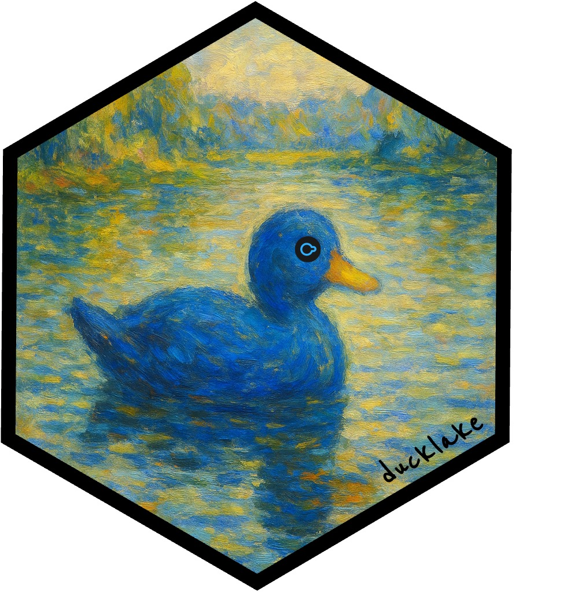

<!-- README.md is generated from README.Rmd. Please edit that file -->

# ducklake <a href="https://github.com/tgerke/ducklake-r"></a>

ducklake is an R package which complements the existing toolkits in the
[duckdb](https://r.duckdb.org/index.html) and
[duckplyr](https://duckplyr.tidyverse.org/index.html) packages, in order
to support the new
[DuckLake](https://ducklake.select/docs/stable/duckdb/introduction.html)
ecosystem.

## Installation

Install the development version of ducklake with

``` r
pak::pak("tgerke/ducklake-r")
```

## Create a local duckdb lakehouse

``` r
library(ducklake)
library(dplyr)

# install the ducklake extension to duckdb 
# requires that you already have DuckDB v1.3.0 or higher
install_ducklake()

# create the ducklake
attach_ducklake("my_ducklake")
# show that we have ducklake files
list.files()
#> [1] "duckplyr"                 "my_ducklake.ducklake"    
#> [3] "my_ducklake.ducklake.wal"

# create a table using the Netherlands train traffic dataset 
create_table("nl_train_stations", "https://blobs.duckdb.org/nl_stations.csv")
# show that we now have a .files directory
list.files()
#> [1] "duckplyr"                   "my_ducklake.ducklake"      
#> [3] "my_ducklake.ducklake.files" "my_ducklake.ducklake.wal"
# main/ is where the parquet files go
list.files("my_ducklake.ducklake.files/main/nl_train_stations")
#> [1] "ducklake-01999cd2-0480-791f-8dbb-617dec483e6e.parquet"

# update the first row with dplyr::rows_update
rows_update(
  get_ducklake_table("nl_train_stations"),
  data.frame(
    uic = 8400319,
    name_short = "NEW"
  ),
  by = "uic",
  copy = TRUE,
  in_place = TRUE,
  unmatched = "ignore"
)

# update with mutate and ducklake::ducklake_exec
get_ducklake_table("nl_train_stations") |>
  mutate(
    name_long = dplyr::case_when(
      code == "ASB" ~ "Johan Cruijff ArenA",
      .default = name_long
    )
  ) |>
  ducklake_exec("nl_train_stations")
#> [1] 578

# filter using ducklake::ducklake_exec
get_ducklake_table("nl_train_stations") |>
  filter(uic == 8400319 | code == "ASB") |>
  ducklake_exec("nl_train_stations")
#> [1] 576

# show our current table
get_ducklake_table("nl_train_stations")
#> # Source:   table<nl_train_stations> [?? x 11]
#> # Database: DuckDB 1.4.0 [tgerke@Darwin 23.6.0:R 4.5.1//private/var/folders/b7/664jmq55319dcb7y4jdb39zr0000gq/T/RtmpVbt6tP/duckplyr/duckplyr2f94e13a87a.duckdb]
#>      id code      uic name_short name_medium      name_long  slug  country type 
#>   <dbl> <chr>   <dbl> <chr>      <chr>            <chr>      <chr> <chr>   <chr>
#> 1   266 HT    8400319 NEW        's-Hertogenbosch 's-Hertog… s-he… NL      knoo…
#> 2    41 ASB   8400074 Bijlmer A  Bijlmer ArenA    Johan Cru… amst… NL      knoo…
#> # ℹ 2 more variables: geo_lat <dbl>, geo_lng <dbl>

# List all tables in the lake
get_ducklake_table("duckdb_tables") |> 
  select(database_name, schema_name, table_name) |> 
  print(n = Inf)
#> # Source:   SQL [?? x 3]
#> # Database: DuckDB 1.4.0 [tgerke@Darwin 23.6.0:R 4.5.1//private/var/folders/b7/664jmq55319dcb7y4jdb39zr0000gq/T/RtmpVbt6tP/duckplyr/duckplyr2f94e13a87a.duckdb]
#>    database_name                   schema_name table_name                       
#>    <chr>                           <chr>       <chr>                            
#>  1 __ducklake_metadata_my_ducklake main        ducklake_column                  
#>  2 __ducklake_metadata_my_ducklake main        ducklake_column_mapping          
#>  3 __ducklake_metadata_my_ducklake main        ducklake_column_tag              
#>  4 __ducklake_metadata_my_ducklake main        ducklake_data_file               
#>  5 __ducklake_metadata_my_ducklake main        ducklake_delete_file             
#>  6 __ducklake_metadata_my_ducklake main        ducklake_files_scheduled_for_del…
#>  7 __ducklake_metadata_my_ducklake main        ducklake_file_column_stats       
#>  8 __ducklake_metadata_my_ducklake main        ducklake_file_partition_value    
#>  9 __ducklake_metadata_my_ducklake main        ducklake_inlined_data_tables     
#> 10 __ducklake_metadata_my_ducklake main        ducklake_metadata                
#> 11 __ducklake_metadata_my_ducklake main        ducklake_name_mapping            
#> 12 __ducklake_metadata_my_ducklake main        ducklake_partition_column        
#> 13 __ducklake_metadata_my_ducklake main        ducklake_partition_info          
#> 14 __ducklake_metadata_my_ducklake main        ducklake_schema                  
#> 15 __ducklake_metadata_my_ducklake main        ducklake_schema_versions         
#> 16 __ducklake_metadata_my_ducklake main        ducklake_snapshot                
#> 17 __ducklake_metadata_my_ducklake main        ducklake_snapshot_changes        
#> 18 __ducklake_metadata_my_ducklake main        ducklake_table                   
#> 19 __ducklake_metadata_my_ducklake main        ducklake_table_column_stats      
#> 20 __ducklake_metadata_my_ducklake main        ducklake_table_stats             
#> 21 __ducklake_metadata_my_ducklake main        ducklake_tag                     
#> 22 __ducklake_metadata_my_ducklake main        ducklake_view                    
#> 23 my_ducklake                     main        nl_train_stations                
#> 24 temp                            main        dbplyr_uyVOXMWBCn

# view snapshots
get_ducklake_table("__ducklake_metadata_my_ducklake.ducklake_snapshot_changes")
#> # Source:   SQL [?? x 5]
#> # Database: DuckDB 1.4.0 [tgerke@Darwin 23.6.0:R 4.5.1//private/var/folders/b7/664jmq55319dcb7y4jdb39zr0000gq/T/RtmpVbt6tP/duckplyr/duckplyr2f94e13a87a.duckdb]
#>   snapshot_id changes_made               author commit_message commit_extra_info
#>         <dbl> <chr>                      <chr>  <chr>          <chr>            
#> 1           0 "created_schema:\"main\""  <NA>   <NA>           <NA>             
#> 2           1 "created_table:\"main\".\… <NA>   <NA>           <NA>             
#> 3           2 "inserted_into_table:1,de… <NA>   <NA>           <NA>             
#> 4           3 "inserted_into_table:1,de… <NA>   <NA>           <NA>             
#> 5           4 "deleted_from_table:1"     <NA>   <NA>           <NA>
get_ducklake_table("__ducklake_metadata_my_ducklake.ducklake_snapshot")
#> # Source:   SQL [?? x 5]
#> # Database: DuckDB 1.4.0 [tgerke@Darwin 23.6.0:R 4.5.1//private/var/folders/b7/664jmq55319dcb7y4jdb39zr0000gq/T/RtmpVbt6tP/duckplyr/duckplyr2f94e13a87a.duckdb]
#>   snapshot_id snapshot_time       schema_version next_catalog_id next_file_id
#>         <dbl> <dttm>                       <dbl>           <dbl>        <dbl>
#> 1           0 2025-09-30 22:50:32              0               1            0
#> 2           1 2025-09-30 22:50:33              1               2            1
#> 3           2 2025-09-30 22:50:33              1               2            3
#> 4           3 2025-09-30 22:50:33              1               2            4
#> 5           4 2025-09-30 22:50:33              1               2            5
```
